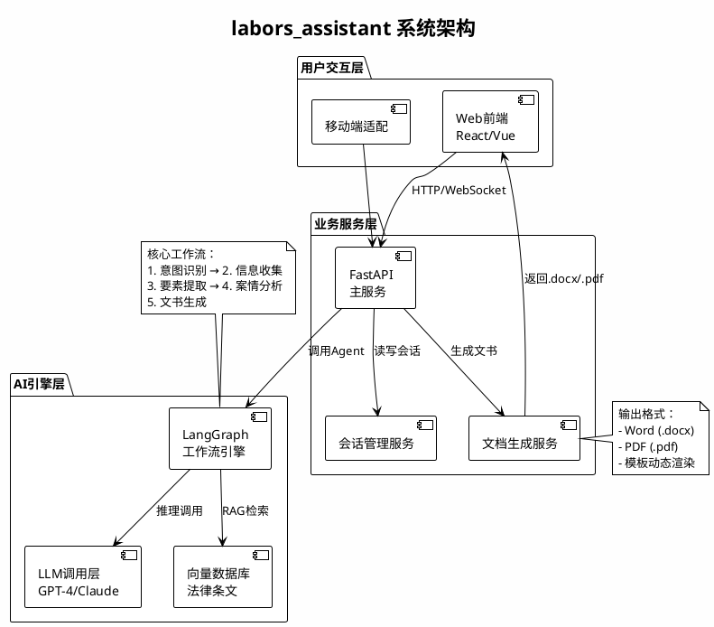

# 劳动者维权AI助手 (labors_assistant)

> 用AI技术帮助劳动者维权，一键生成高质量诉状，让法律援助不再是奢侈品。

## 📖 用户故事

### 故事1：快速生成诉状
**角色：** 拖欠工资的劳动者  
**场景：** 小王在某互联网公司工作8个月，被拖欠4个月工资，想起诉公司。  
**需求：** 通过简单的对话收集信息，系统自动生成一份格式正确、法律用语准确的诉状。  
**验收标准：** 
- 5轮以内的对话完成信息收集
- 生成的诉状包含完整的"当事人""事实和理由""诉讼请求"
- 诉状引用适用法律条款（《劳动法》《劳动合同法》等）
- 导出PDF/Word格式可供法院提交

### 故事2：多轮精化诉状
**角色：** 需要补充细节的劳动者  
**场景：** 首次对话后生成诉状，但发现细节不清楚，想修改并重新生成。  
**需求：** 支持多轮对话补充/修改信息，系统更新诉状内容。  
**验收标准：**
- 用户可编辑已收集的信息字段
- 修改后能快速重新生成诉状（<10s）
- 诉状版本有清晰的变更记录

### 故事3：参考相似案例
**角色：** 想了解法律胜诉可能性的劳动者  
**场景：** 想知道"拖欠工资"案件通常的判决结果和赔偿标准。  
**需求：** 系统自动检索相似的历史案例和适用法规条款，展示给用户参考。  
**验收标准：**
- 能从赛方法律API检索相似案例（2-3个）
- 展示案例的当事人、判决结果、法律依据
- 用户可点击"应用此案例"快速填充信息

### 故事4：下载和编辑诉状
**角色：** 准备提交法院的劳动者  
**场景：** 诉状生成后，想以Word格式下载，在律师帮助下做最后调整，然后打印提交法院。  
**需求：** 支持Word (.docx) 和PDF格式导出，用户可在Word中编辑。  
**验收标准：**
- 导出的Word格式排版规范，可被法院系统识别
- 所有法律术语和计算结果正确
- 用户可在Word中编辑，格式不破坏

---

## 🎯 核心功能

### P0 MVP必须
| 功能 | 说明 | 负责人 | 截止日期 |
|------|------|-------|---------|
| **多轮对话** | AI助手通过交互式对话收集诉讼信息 | 前端 + Agent | 4月10日 |
| **意图识别** | 自动识别纠纷类型（拖欠工资/劳动合同纠纷/工伤赔偿） | Agent | 4月10日 |
| **要素提取** | 智能提取当事人、事实、法律要素 | Agent | 4月10日 |
| **法律分析** | 检索赛方API的适用法条和相似案例 | Agent | 4月10日 |
| **诉状生成** | 格式规范、法律用语准确的诉状 | 文档系统 | 4月13日 |
| **多格式导出** | 支持Word (.docx) 和PDF格式下载 | 文档系统 + 后端 | 4月13日 |

### P1 如时间允许
| 功能 | 说明 | 负责人 | 截止日期 |
|------|------|-------|---------|
| **会话管理** | 用户保存对话历史，多次编辑和重新生成 | 后端 | 4月18日 |
| **案例查询** | 检索相似案例，参考判决结构 | Agent | 4月18日 |
| **用户账户** | 简单的用户注册和登录 | 后端 | 4月18日 |

---


## 系统架构



## 👥 团队分工

|业务|核心任务|框架|交付物|
|:--:|--|--|--|
|后端|FastAPI架构、数据库、接口设计| FastAPI主框架、数据库、会话管理、API文档 | API Swagger文档、单元测试 |
|agent|LangGraph工作流、LLM调优、Prompt、RAG接入| LangGraph工作流、Prompt编写、RAG集成 | 工作流验收文档、Prompt库 |
|前端|React界面、对话组件、文件下载| React项目、对话UI、表单、集成后端 | UI原型、功能演示 |
|文档系统|Word模板、python-docx、格式渲染| 诉讼模板设计、python-docx、质量验证 | 3+诉状模板、导出样本 |
|测试运维|测试用例、部署、文档、辅助开发| CI/CD、集成测试、部署、演示 | 测试报告、部署指南、Demo视频 |

**协作规则**：
- 代码审查：每个PR需1名不同模块评审人
- 周会讨论：每周一次集成进度检查
- 文档同步：模块间接口文档保持最新

---

## 📅 开发里程碑

| 时间 | 里程碑 | 验收标准 |
|------|------|--------|
| **3月30日** | ✅ API设计冻结 | 所有接口清晰定义，无歧义 |
| **4月6日** | ✅ 端到端可跑通 | 用mock数据完整跑通全链路 |
| **4月10日** | ✅ Alpha版本 | 接入赛方API，生成3个真实样例 |
| **4月13日** | ✅ Beta版本 | 完整UI、无critical bug |
| **4月18日** | 🚀 **最终提交** | 源代码 + 演示视频 + 部署指南 |

---

## 💻 技术栈

| 模块 | 技术选择 | 版本/说明 |
|------|--------|----------|
| **后端API** | FastAPI | >=0.100 (异步、自动文档) |
| **ORM** | SQLAlchemy | >=2.0 (异步支持) |
| **数据库** | SQLite/PostgreSQL | 开发SQLite，生产Postgres |
| **AI工作流** | LangGraph | >=0.1.x (状态机、编排) |
| **LLM调用** | LangChain | >=0.1.x (模型适配) |
| **前端框架** | React + TypeScript | ^18.0 |
| **UI组件** | Ant Design | >=5.0 |
| **文档处理** | python-docx | >=0.8.11 |
| **测试框架** | pytest | >=7.0 |
| **CI/CD** | GitHub Actions | 自动化集成测试 |

---

## 🚀 快速启动

### 前置条件
```
Python 3.10+  |  Node 18+  |  Git
```

### 环境搭建

**1. 克隆仓库**
```bash
git clone https://github.com/labors-assistant/labors_assistant.git
cd labors_assistant
```

**2. 后端启动**
```bash
python -m venv venv
source venv/bin/activate

pip install -r requirements-backend.txt
cp .env.example .env          # 编辑.env，填入赛方API密钥
python scripts/init_db.py

# 启动FastAPI (http://localhost:8000)
uvicorn backend.main:app --reload
# API文档: http://localhost:8000/docs
```

**3. 前端启动**
```bash
cd frontend
npm install
npm run dev  # http://localhost:3000
```

**4. 验证系统**
```bash
curl http://localhost:8000/api/health
# 浏览 http://localhost:3000
```

### 运行测试
```bash
pytest tests/unit/ -v           # 后端单元测试
pytest tests/integration/ -v    # 集成测试
cd frontend && npm test         # 前端测试
```

### 部署到云环境
```bash
docker compose -f docker-compose.prod.yml build
docker compose -f docker-compose.prod.yml up -d
docker logs -f labors-backend
```

---

## 📁 项目结构

```
labors_assistant/
├── README.md
├── LICENSE
├── requirements-backend.txt
├── .env.example
│
├── backend/                 # FastAPI业务服务
│   ├── main.py
│   ├── api/routes.py, schema.py
│   ├── services/chat.py, document.py, agent.py
│   ├── db/models.py, database.py
│   └── config.py
│
├── agent/                   # LangGraph AI工作流
│   ├── workflow.py
│   ├── prompts.py
│   ├── nodes/intent.py, collection.py, extraction.py, analysis.py
│   └── rag/legal_search.py
│
├── frontend/                # React前端
│   ├── src/pages/ChatPage.tsx, PreviewPage.tsx, ResultPage.tsx
│   ├── src/components/ChatBox.tsx, FormBuilder.tsx, DocPreview.tsx
│   ├── src/services/api.ts
│   └── package.json
│
├── docs/                    # 文档和模板
│   ├── templates/labor_dispute.docx, wage_arrears.docx, work_injury.docx
│   ├── API.md, ARCHITECTURE.md, CONTRIBUTION.md
│
├── tests/                   # 测试用例
│   ├── unit/test_api.py, test_services.py, test_workflow.py
│   ├── integration/test_end2end.py, test_document_generation.py
│   └── fixtures/chat_history.json, legal_case.json
│
└── deployment/              # 部署配置
    ├── Dockerfile, docker-compose.yml
    └── scripts/init_db.py, seed_templates.py
```

---

## 🔄 Git工作流

### 分支策略
```
main (稳定发布) ← dev (开发主分支) ← feature/{模块}/{功能}
```

### 创建特性分支
```bash
git checkout -b feature/backend/session-management dev
git checkout -b feature/agent/intent-classification dev
git checkout -b feature/frontend/chat-ui dev
```

### Commit规范
```
<type>(<scope>): <subject>

<body>
<footer>
```

**类型定义**：`feat` | `fix` | `refactor` | `test` | `docs` | `chore`

---

## 🧪 质量标准

### 性能基准
```
API响应 (非LLM):  <100ms
前端加载:         <3s
诉状导出:         <5s
RAG检索:          <2s
```

### 代码覆盖率
- 后端：>=70%  |  前端：>=50%  |  Agent：>=60%
